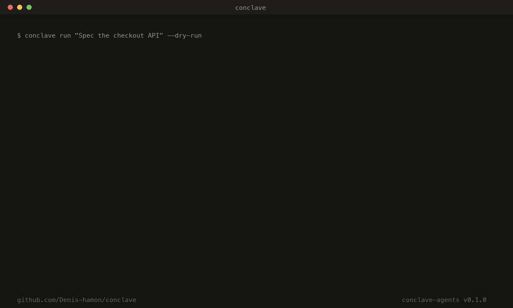

# Conclave — Implementation Roadmap for Claude Code

> This document is a complete task list for Claude Code.
> Execute tasks in order. Each section is a self-contained sprint.
> Repository: https://github.com/Denis-hamon/conclave

---

## Context & Architecture

Conclave is a multi-agent organizational framework built on Anthropic's API.
It has three layers:

1. **Organisation** — YAML org chart, persistent role agents, personas, hierarchy
2. **Orchestration** — Message bus, deliberation modes, Decision Trail
3. **Certification** — Observatory → Skillset → Simulator → Certifier → Routing Policy

Current state: core code exists, zero tests, no demo, no dashboard.
Stack: Python 3.11+, Click CLI, Rich terminal UI, Anthropic SDK, PyYAML.

Key files:
- `conclave/agent.py` — ConclaveAgent (one persistent role)
- `conclave/bus.py` — ConclaveBus (message router + deliberation)
- `conclave/router.py` — TaskRouter (routes tasks to Haiku vs Sonnet)
- `conclave/cost.py` — CostMeter (token cost tracking)
- `conclave/certification/` — observatory, skillset, simulator, certifier
- `conclave/cli.py` — Click CLI (run, init, observe, simulate, certify, status)
- `.claude/commands/conclave.md` — /conclave slash command

---

## SPRINT 1 — Foundations (tests + dry-run)

### 1.1 Project setup

```bash
pip install -e ".[dev]"
```

Add to `pyproject.toml` under `[project.optional-dependencies]`:

```toml
dev = [
  "pytest>=8.0",
  "pytest-asyncio>=0.23",
  "pytest-mock>=3.12",
  "respx>=0.20",
]
```

Create `tests/__init__.py` (empty).
Create `tests/conftest.py` with shared fixtures (see 1.2).

---

### 1.2 Test fixtures — `tests/conftest.py`

Create a `mock_client` fixture that returns a `MagicMock` mimicking `anthropic.Anthropic`.

The mock must satisfy:
- `client.messages.create()` returns an object with:
  - `.content[0].text` → a string
  - `.usage.input_tokens` → int (e.g. 100)
  - `.usage.output_tokens` → int (e.g. 50)

Create a `sample_org_yaml` fixture that writes a minimal `conclave.yml` to a tmp directory:

```yaml
org:
  name: "Test Org"
  deliberation: hierarchy
  agents:
    - role: Lead
      persona: "You are a lead agent."
      tools: []
    - role: Worker
      persona: "You are a worker agent."
      reports_to: Lead
      tools: []
```

---

### 1.3 Unit tests — `tests/test_router.py`

Test `TaskRouter.route()`:

- **test_routes_novel_task_to_sonnet**: mock classifier returning `novelty=0.8, complexity=0.7` → assert `decision.model == ModelTier.SONNET`
- **test_routes_repetitive_task_to_haiku**: mock classifier returning `novelty=0.1, complexity=0.2, is_repetitive=True` → assert `decision.model == ModelTier.HAIKU` and `decision.use_loop == True`
- **test_routes_filesystem_task_to_deepagents**: mock classifier returning `needs_filesystem=True` → assert `decision.executor == ExecutorType.DEEPAGENTS`
- **test_classifier_parse_error_fallback**: mock `client.messages.create()` returning malformed JSON → assert graceful fallback to Sonnet defaults
- **test_force_model_override**: instantiate agent with `force_model="claude-haiku-4-5-20251001"` → assert model is always Haiku regardless of task

---

### 1.4 Unit tests — `tests/test_cost.py`

Test `CostMeter`:

- **test_record_and_total**: record Haiku usage (1M input, 1M output) → assert `total_cost` ≈ 4.80
- **test_baseline_always_sonnet**: same tokens → assert `baseline_cost` ≈ 18.00
- **test_savings_pct**: assert `savings_pct` ≈ 73%
- **test_merge**: two meters merged → totals sum correctly
- **test_summary_lines_format**: `summary_lines()` returns a list of strings, each containing the model short name and a dollar amount

---

### 1.5 Unit tests — `tests/test_agent.py`

Test `ConclaveAgent`:

- **test_receive_returns_message**: mock `_call_claude()` returning `"[TO: Worker]\nHere is the task.\n[REASONING: delegating to worker]"` → assert response has `recipient="Worker"`, `msg_type="handoff"`, `reasoning` is not None
- **test_history_accumulates**: call `receive()` twice → assert `len(agent.history) == 4` (2 user + 2 assistant)
- **test_output_parsed**: mock response starting with `[OUTPUT: spec.md]` → assert `msg_type == "output"`
- **test_escalation_parsed**: mock response starting with `[ESCALATE: Lead]` → assert `msg_type == "escalation"` and `recipient == "Lead"`

---

### 1.6 Unit tests — `tests/test_bus.py`

Test `ConclaveBus`:

- **test_single_turn_routing**: two agents (Lead → Worker), seed message to Lead, mock Lead returning `[TO: Worker]\nDo this`, mock Worker returning `[OUTPUT: result.md]\nDone` → assert `bus.outputs` has one entry
- **test_decision_trail_written**: after `bus.run()`, assert trail JSONL file exists and each line is valid JSON with `from`, `to`, `type`, `content` keys
- **test_max_turns_stops_loop**: set `max_turns=2`, mock agents always returning `[TO: OtherAgent]\nContent` → assert loop stops at 2 turns

---

### 1.7 Integration test — `tests/test_integration.py`

Test full pipeline with mocked API:

- **test_full_run_product_squad**: load `examples/product_squad.yml`, mock all API calls, run `bus.run("Test goal", "CPO")` → assert no exceptions, trail file created, cost meter has entries

---

### 1.8 CI — `.github/workflows/test.yml`

```yaml
name: tests
on: [push, pull_request]
jobs:
  test:
    runs-on: ubuntu-latest
    steps:
      - uses: actions/checkout@v4
      - uses: actions/setup-python@v5
        with:
          python-version: "3.12"
      - run: pip install -e ".[dev]"
      - run: pytest tests/ -v --tb=short
```

---

### 1.9 Dry-run mode — `conclave/dry_run.py`

Create a `DryRunClient` class that mocks `anthropic.Anthropic` completely:

```python
class DryRunClient:
    """Drop-in replacement for anthropic.Anthropic with zero API calls."""
```

It must respond to `client.messages.create()` with realistic-looking fake responses:

- If system prompt contains "classifier" or "routing" → return JSON `{"novelty": 0.6, "complexity": 0.6, "is_repetitive": false, "needs_filesystem": false, "rationale": "[dry-run]"}`
- If system prompt contains "evaluator" → return JSON `{"score": 0.85, "passed": true, "feedback": ""}`
- Otherwise → generate a plausible agent response based on the role in the system prompt, including `[TO: NextRole]` routing if a hierarchy is detected, and `[REASONING: dry-run simulation]`

Add `--dry-run` flag to `conclave run`:

```bash
conclave run "Test goal" --dry-run
```

When `--dry-run` is active:
- Use `DryRunClient` instead of real Anthropic client
- Display `[DRY RUN — no API calls made]` banner at top
- Show simulated token costs (use average estimates)
- Still write the Decision Trail to `.conclave/dry_run_trail_{ts}.jsonl`

---

## SPRINT 2 — Demo & Visibility

### 2.1 Demo script — `examples/demo.py`

Create a standalone demo script that:

1. Uses `DryRunClient` (no API key needed)
2. Loads `examples/product_squad.yml`
3. Runs the goal: `"Design and spec a new checkout API with idempotency support"`
4. Produces realistic-looking agent dialogue with deliberate pacing (add `time.sleep(0.3)` between each print for terminal recording)
5. Ends with a cost breakdown showing ~70% savings vs baseline

The script must be runnable with zero config:

```bash
python examples/demo.py
```

The terminal output must be visually compelling — this is what gets recorded as a GIF.

---

### 2.2 Recording instructions — `examples/DEMO_RECORDING.md`

Write a short guide for recording the demo GIF:

- Install `vhs` (https://github.com/charmbracelet/vhs) or `asciinema`
- Recommended terminal size: 120×35
- Font: JetBrains Mono or similar monospaced
- Recommended tool: `vhs` with a `demo.tape` file

Create `examples/demo.tape` for vhs:

```
Output examples/demo.gif
Set FontSize 14
Set Width 1200
Set Height 700
Set Theme "Catppuccin Mocha"
Type "python examples/demo.py"
Enter
Sleep 30s
```

---

### 2.3 ANTHROPIC.md

Create `ANTHROPIC.md` at repo root. This file is specifically for Anthropic's DevRel and product teams.

Content must cover:

**Section 1 — How Conclave uses Anthropic primitives**
- Managed Agents: each ConclaveAgent maps to a Managed Agent session (explain the beta header, the session lifecycle)
- MCP: each tool in an agent's `tools:` list maps to an MCP server connector
- Model tiers: explain the deliberate use of Haiku / Sonnet / Opus at different layers (classifier on Haiku, deliberation on Sonnet, distillation on Sonnet, simulation eval on Haiku)
- Claude Code: the `/conclave` slash command integration

**Section 2 — The gap Conclave fills**
- Managed Agents ships single-agent today; Conclave demonstrates multi-agent coordination natively
- No existing tool models org-level coordination (roles, accountability, persistent memory per role)
- The certification pipeline demonstrates that Haiku is production-viable for well-defined tasks — validating the full model tier strategy

**Section 3 — What Conclave is not**
- Not a wrapper around LangChain
- Not a competitor to Managed Agents
- Not a fine-tuning tool

**Section 4 — Integration roadmap**
- When Anthropic ships native multi-agent GA, Conclave will swap `agent.py` for the session API — one file change
- Conclave is designed to be the reference implementation that grows with the platform

---

### 2.4 Update README.md

Add the following sections to the existing README:

**After the intro block**, add:
```
> 🎬 [Watch the demo](#demo) · ⭐ Star to follow development · 📖 [ANTHROPIC.md](ANTHROPIC.md)
```

**Demo section** (after the feature table):
```markdown
## Demo



*Product Squad deliberating on a checkout API spec. 3 agents, 8 turns, 71% cheaper than all-Sonnet.*
```

**Quickstart section** — rewrite to be copy-pasteable in under 60 seconds:
```bash
pip install conclave-agents
conclave init --template product-squad
conclave run "Your goal here" --dry-run   # no API key needed
export ANTHROPIC_API_KEY=sk-ant-...
conclave run "Your goal here"
```

**Badges** — add at top of README after the title:
```markdown


```

---

## SPRINT 3 — Dashboard

### 3.1 Architecture

Create `conclave/dashboard/` package.

The dashboard is a local web UI launched by `conclave dashboard` that runs on `http://localhost:7777`.

Stack:
- Backend: FastAPI + uvicorn (add to dependencies)
- Frontend: single `index.html` with vanilla JS + CSS (no build step, no npm)
- Real-time updates: Server-Sent Events (SSE) from FastAPI to browser
- No authentication (local only)

Add to `pyproject.toml`:
```toml
dependencies = [
  ...existing...,
  "fastapi>=0.110",
  "uvicorn>=0.29",
]
```

---

### 3.2 Backend — `conclave/dashboard/server.py`

FastAPI app with these endpoints:

**`GET /`** — serve `index.html`

**`GET /api/org`** — return the current org structure from `conclave.yml`:
```json
{
  "name": "Product Squad",
  "agents": [
    {"role": "CPO", "reports_to": null, "tools": ["notion", "slack"]},
    {"role": "TechLead", "reports_to": "CPO", "tools": ["github", "linear"]},
    {"role": "QA", "reports_to": "TechLead", "tools": ["github"]}
  ]
}
```

**`GET /api/trail`** — return the last N entries from the most recent Decision Trail JSONL:
```json
{
  "trail": [
    {"ts": "...", "from": "CPO", "to": "TechLead", "type": "delegation", "content": "...", "reasoning": "..."},
    ...
  ],
  "trail_file": ".conclave/trail_20260418_120000.jsonl"
}
```

**`GET /api/status`** — return certification routing policy + cost summary:
```json
{
  "certifications": [...],
  "certified_share_pct": 58,
  "total_cost_usd": 0.0805,
  "baseline_cost_usd": 0.234,
  "savings_pct": 65.6
}
```

**`GET /api/events`** — SSE endpoint that watches `.conclave/` for new trail entries and pushes them to the browser in real-time. Use `watchfiles` or poll every 500ms.

Add `watchfiles` to dependencies.

---

### 3.3 Frontend — `conclave/dashboard/index.html`

Single self-contained HTML file. No external dependencies except fonts from Google Fonts.

**Design language:**
- Dark theme: background `#0d0d0d`, surface `#141414`, border `#1e1e1e`
- Accent: `#f97316` (orange — Anthropic-adjacent)
- Font: `IBM Plex Mono` for data, `Inter` for UI labels
- Minimal, dense, information-rich — not a marketing page

**Layout (three panels):**

```
┌─────────────────┬──────────────────────────┬──────────────────┐
│   ORG GRAPH     │   DECISION TRAIL         │   COST & STATUS  │
│                 │                          │                  │
│  CPO            │  [CPO → TechLead]        │  Haiku   $0.043  │
│   └─ TechLead   │  "Spec the checkout..."  │  Sonnet  $0.037  │
│       └─ QA     │                          │  ────────────    │
│                 │  [TechLead → QA]         │  Saved    65.6%  │
│  ● live         │  "Attached spec..."      │                  │
│                 │                          │  Certifications  │
│                 │  [QA → CPO]              │  write_ticket ✓  │
│                 │  "3 blockers found"      │  gen_tests    ~  │
└─────────────────┴──────────────────────────┴──────────────────┘
```

**Org Graph panel:**
- Render the hierarchy as an SVG tree (vanilla JS, no D3)
- Each node is a box with the role name and a colored dot (green = active, grey = idle)
- Animate a message "pulse" along the edge when a handoff occurs (use SSE events)

**Decision Trail panel:**
- Scrolling list of trail entries, newest at bottom
- Each entry: timestamp (dim), `FROM → TO` header (colored by role), message preview, reasoning in italic
- New entries appear with a fade-in animation
- Filter buttons: All / Delegation / Handoff / Escalation / Output

**Cost & Status panel:**
- Live cost breakdown table (Haiku / Sonnet / Total / Baseline / Saved)
- Certification table with status badges
- "Certified workload share" progress bar (orange fill)

---

### 3.4 CLI command — add to `conclave/cli.py`

```python
@cli.command()
@click.option("--org",  default="conclave.yml", show_default=True)
@click.option("--port", default=7777, show_default=True)
def dashboard(org, port):
    """Launch the Conclave dashboard at http://localhost:{port}"""
```

Implementation:
- Load org from YAML
- Start uvicorn server with the FastAPI app
- Open browser automatically with `webbrowser.open(f"http://localhost:{port}")`
- Print: `◆ Conclave Dashboard → http://localhost:{port}`

---

## SPRINT 4 — Benchmark

### 4.1 Benchmark runner — `conclave/benchmark.py`

Create `ConclaveBenchmark` class that runs a fixed set of 20 tasks through three configurations:

- **Config A**: All tasks on Haiku (no skillset)
- **Config B**: All tasks on Sonnet
- **Config C**: Conclave routing (router decides per task)

Each task has:
- `id`: short slug
- `role`: which role executes it
- `input`: the task prompt
- `category`: strategic / operational / repetitive / technical

The 20 benchmark tasks must cover all 4 categories and all common org roles.

For each task × config, record:
- model used
- input/output tokens
- cost USD
- quality score (self-evaluated on Haiku)
- latency (seconds)

---

### 4.2 Benchmark tasks — `conclave/benchmark_tasks.py`

Define the 20 tasks as a Python list of dicts. Include:

**Repetitive (expected: Haiku wins)**
- `write_ticket`: "Write a Jira ticket for adding rate limiting to the payments API"
- `format_report`: "Format this JSON as a markdown table: {...}"
- `weekly_summary`: "Write a weekly summary for the CPO from these bullet points: [...]"
- `stakeholder_email`: "Draft an email to the CTO explaining a 2-week delay on the checkout feature"
- `test_plan_template`: "Generate a test plan template for an OAuth2 login flow"

**Operational (expected: mixed)**
- `ticket_triage`: "Triage these 5 bug reports and assign priority: [...]"
- `spec_review`: "Review this API spec and flag any missing error codes: [...]"
- `dependency_check`: "List the dependencies and blockers for this feature: [...]"
- `meeting_notes`: "Summarize these meeting notes into decisions and action items: [...]"
- `risk_assessment`: "Identify risks in this technical approach: [...]"

**Technical (expected: Sonnet wins)**
- `architecture_review`: "Review this microservices architecture and flag scalability issues"
- `security_audit`: "Audit this auth flow for OWASP Top 10 vulnerabilities"
- `api_design`: "Design a REST API for a multi-tenant billing system"
- `code_review`: "Review this Python function for correctness and performance"
- `database_schema`: "Design a database schema for an e-commerce order system"

**Strategic (expected: Sonnet wins)**
- `define_strategy`: "Define our Q3 product strategy given these market signals: [...]"
- `prioritization`: "Prioritize these 8 features using RICE framework"
- `competitive_analysis`: "Analyze how we should respond to this competitor move: [...]"
- `okr_definition`: "Define OKRs for the product team for next quarter"
- `postmortem`: "Write a postmortem for this production incident: [...]"

---

### 4.3 Benchmark results — `benchmarks/results.json`

After running, save results to `benchmarks/results.json`. This file is committed to the repo and updated with each benchmark run.

Structure:
```json
{
  "run_at": "2026-04-18T...",
  "conclave_version": "0.1.0",
  "haiku_model": "claude-haiku-4-5-20251001",
  "sonnet_model": "claude-sonnet-4-6",
  "summary": {
    "haiku_only_cost": 0.042,
    "sonnet_only_cost": 0.312,
    "conclave_cost": 0.091,
    "conclave_saving_vs_sonnet_pct": 70.8,
    "conclave_quality_vs_sonnet_pct": 94.2
  },
  "tasks": [...]
}
```

---

### 4.4 Benchmark CLI command

```bash
conclave benchmark [--dry-run] [--output benchmarks/results.json]
```

At the end, print a summary table:

```
◆ Conclave Benchmark — 20 tasks

  Category      Haiku    Sonnet   Conclave   Quality
  ──────────────────────────────────────────────────
  repetitive    $0.008   $0.062   $0.009      97%
  operational   $0.011   $0.081   $0.024      91%
  technical     $0.014   $0.098   $0.071      96%
  strategic     $0.009   $0.071   $0.065      98%
  ──────────────────────────────────────────────────
  TOTAL         $0.042   $0.312   $0.091      94%

  Conclave saves 70.8% vs all-Sonnet at 94.2% quality parity.
```

---

## SPRINT 5 — Managed Agents native backend

### 5.1 Backend abstraction — `conclave/backends/base.py`

Create abstract base class:

```python
class AgentBackend(ABC):
    @abstractmethod
    def create_session(self, role: str, system: str) -> str:
        """Returns a session_id."""

    @abstractmethod  
    def send(self, session_id: str, messages: list[dict]) -> tuple[str, int, int]:
        """Returns (response_text, input_tokens, output_tokens)."""
```

---

### 5.2 Direct API backend — `conclave/backends/anthropic_direct.py`

Move current `_call_claude()` logic from `agent.py` into this backend.
This is the current default — stateless, sends full history each call.

---

### 5.3 Managed Agents backend — `conclave/backends/managed_agents.py`

Implement the Managed Agents backend using the beta header:

```python
headers = {
    "anthropic-beta": "managed-agents-2026-04-01",
    "Content-Type": "application/json",
}
```

Endpoints to implement:
- `POST /v1/agents` — create agent definition
- `POST /v1/sessions` — create session
- `POST /v1/sessions/{id}/messages` — send message
- `GET /v1/sessions/{id}` — get session state

Handle graceful fallback to `AnthropicDirectBackend` if the beta header is not yet available on the account.

---

### 5.4 Backend selector in YAML

```yaml
org:
  backend: managed_agents   # managed_agents | anthropic | local
```

The `org.py` loader instantiates the appropriate backend class.
Per-agent override:

```yaml
agents:
  - role: CPO
    backend: managed_agents   # override org-level default
```

---

## Final checklist before Show HN

- [ ] `pytest tests/` → all green
- [ ] `conclave run "test" --dry-run` → works with zero config
- [ ] `python examples/demo.py` → compelling terminal output
- [ ] Demo GIF recorded and committed to `examples/demo.gif`
- [ ] GIF embedded in README
- [ ] Badges in README all green
- [ ] `ANTHROPIC.md` committed
- [ ] `benchmarks/results.json` committed with real numbers
- [ ] `conclave dashboard` → opens browser, shows live org graph
- [ ] `pip install conclave-agents` → installs cleanly from PyPI
- [ ] GitHub Actions CI → green checkmark on repo page

---

## Notes for Claude Code

- Always run `pytest tests/` after each sprint before moving to the next
- Use `rich` for all terminal output (already a dependency)
- Never hardcode the Anthropic API key — always read from `os.environ`
- The `DryRunClient` must be usable everywhere a real `anthropic.Anthropic` is used
- Dashboard frontend must work with zero npm / no build step
- Keep `conclave/cli.py` as the single entrypoint — no separate scripts
- All new CLI commands follow the existing Click pattern in `cli.py`
- New dependencies must be added to `pyproject.toml` before use
