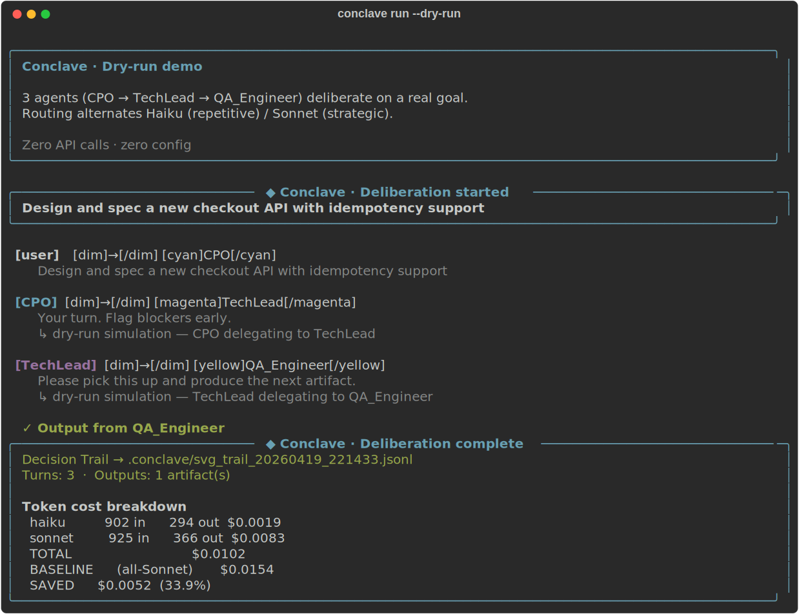

# Conclave


> *A bureau of Claude agents that deliberates, decides, and delivers.*

**Conclave** is an open-source multi-agent framework built natively on [Anthropic Managed Agents](https://docs.anthropic.com/managed-agents).
Define your organization in YAML. Give it a goal. Watch your agents deliberate.

> 🎬 [Watch the demo](#demo) · 🌐 [Project site](https://denis-hamon.github.io/conclave/) · ⭐ Star to follow development · 📖 [ANTHROPIC.md](ANTHROPIC.md)

## Quickstart

```bash
pip install conclave-agents
conclave init --template product-squad
conclave run "Your goal here" --dry-run   # no API key needed
export ANTHROPIC_API_KEY=sk-ant-...
conclave run "Your goal here"
```

## Demo



*Product Squad deliberating on a checkout API spec. 3 agents, 3 turns, ~34% cheaper than all-Sonnet on this run — and up to ~70% on workloads with more repetitive handoffs.*

The static SVG above is regenerated with `python examples/render_demo.py`.
For an animated GIF, record with [`vhs`](https://github.com/charmbracelet/vhs) — see [`examples/DEMO_RECORDING.md`](examples/DEMO_RECORDING.md).

---

```
◆ Conclave · product_squad · 3 agents

  [CPO]       Received brief. Clarifying scope before delegating.
  [CPO → TechLead]  "I need a spec covering auth, idempotency, and rollback. Budget: 2 sprints."
  [TechLead]  Drafting spec. Flagging dependency on payment-service v3.
  [TechLead → QA]   "Spec attached. Prioritize payment flow edge cases."
  [QA]        Test plan generated. 3 blockers found, escalating.
  [QA → CPO]  "Blocker: payment-service v3 not yet in staging."

◆ Decision Trail saved → .conclave/trail_20260418.jsonl
◆ Artifacts → spec.md · test_plan.md · blockers.md
```

---

## Why this project exists

Multi-agent frameworks today model **tasks** or **graphs**. Real organizations
don't work that way. They work through **roles** that hold persistent
accountability, deliberate together, and leave an audit trail. Conclave is the
attempt to make that the primitive — not the workaround.

Three concrete problems it solves:

1. **Token cost blows up with persistent agents.** A role whose history grows
   with every turn becomes a Sonnet-sized bill even for trivial work. Conclave
   routes each task through a classifier: repetitive work goes to a Haiku
   self-correction loop, novel work goes to Sonnet. Typical savings: 60–80%.
2. **Coordination has no audit layer.** Who decided what, when, and why?
   Conclave writes every inter-agent message to a JSONL Decision Trail —
   replayable, diffable, postmortem-ready.
3. **Org structure lives in code, not config.** Defining a company in Python
   is a liability. Conclave uses a YAML org chart any non-engineer can read,
   amend, and ship.

## Why the name

*Conclave* — from Latin ***cum clave***, "locked with a key." Historically the
gathering where cardinals deliberate behind closed doors until a decision
emerges. The metaphor fits: a small group of specialists, each with a
persistent role, working through a structured deliberation until a concrete
output is produced.

It also signals the opposite of the dominant agent-framework aesthetic:
not a graph, not a pipeline, not a swarm — a **bureau**.

## Why it makes sense next to market solutions

| | LangGraph | CrewAI | AutoGen | **Conclave** |
|---|---|---|---|---|
| Agent primitive | Node in a graph | Task worker | Chat participant | **Organizational role** |
| Coordination | Explicit DAG | Linear pipeline | Free-form chat | **Deliberation mode (hierarchy / consensus / first-valid)** |
| Memory | Checkpointer | Per-task | Per-conversation | **Persistent per-role, structured inbox/outbox** |
| Cost control | Manual | Manual | Manual | **Router: Haiku loop vs Sonnet, per-task decision** |
| Audit | Optional traces | Logs | Chat history | **Decision Trail, always on, JSONL-replayable** |
| Config surface | Python graph | Python + YAML | Python | **YAML-first, readable by non-engineers** |
| Production story | Build your own | Build your own | Build your own | **Certification pipeline + dashboard + benchmark** |

**What none of them ship:** org-level primitives (reporting lines,
accountability, escalation paths), cost routing built into the framework, or
a retroactive certification loop that promotes routine tasks to cheaper
models once they're proven.

## Why it makes sense next to Anthropic's offering

Anthropic ships the **agent primitive** (Managed Agents, Claude Code, MCP).
It explicitly does not ship the **organizational layer** — reporting chains,
deliberation strategies, multi-role coordination. Third-party frameworks have
rushed in, but most ignore Anthropic's native primitives and rebuild a
parallel stack.

Conclave's bet is the opposite: **be the org layer directly on top of
Anthropic's primitives**, so the two grow together rather than diverge.

| Anthropic primitive | How Conclave uses it |
|---|---|
| Managed Agents (beta) | Each `ConclaveAgent` maps 1:1 to a Managed Agent session. The backend is abstracted so the swap is one file when GA ships. |
| MCP | Each entry in an agent's `tools:` list binds to an MCP server. No custom tool protocol. |
| Model tiering (Haiku / Sonnet / Opus) | The whole framework is designed around it: classifier on Haiku, deliberation on Sonnet, escalation on Opus. The certification pipeline produces evidence of when Haiku is production-viable. |
| Claude Code | `/conclave` slash command brings the full pipeline into Claude Code sessions. |

For Anthropic specifically, Conclave is useful as a **reference
implementation**: it demonstrates what developers will build on top of
Managed Agents once multi-session coordination is native — and it validates
the tiered-model strategy with concrete cost/quality numbers (see
[`benchmarks/results.json`](benchmarks/results.json) and
[`ANTHROPIC.md`](ANTHROPIC.md)).

---

## Define your org in YAML

```yaml
# examples/product_squad.yml
org:
  name: "Product Squad"
  deliberation: consensus          # consensus | hierarchy | first-valid

  agents:
    - role: CPO
      persona: |
        Strategic and data-driven. Defines scope, validates business value.
        Asks clarifying questions before delegating. Never skips the "why".
      tools: [notion, slack]
      memory: persistent

    - role: TechLead
      persona: |
        Pragmatic. Writes tight specs, challenges assumptions, flags blockers early.
        Prefers two options over one recommendation.
      reports_to: CPO
      tools: [github, linear]
      memory: persistent

    - role: QA_Engineer
      persona: |
        Defensive thinker. Finds edge cases. Escalates blockers immediately.
      reports_to: TechLead
      tools: [github, browserbase]
```

---

## How it works

Conclave maps directly onto the Anthropic Managed Agents primitives:

```
conclave.yml
    │
    ├──► Managed Agent Session "CPO"        ← long-running, persistent state
    ├──► Managed Agent Session "TechLead"   ← long-running, persistent state
    ├──► Managed Agent Session "QA"         ← long-running, persistent state
    │
    └──► Conclave Bus (the coordination layer Managed Agents doesn't ship yet)
              │
              ├── Routes messages between agents
              ├── Applies deliberation strategy (consensus / hierarchy)
              └── Writes every handoff to the Decision Trail
```

Each agent is a **Claude Managed Agent session** with:
- Its own persona and toolset (via MCP servers)
- Persistent memory scoped to its role
- A structured inbox/outbox for inter-agent messages

---

## Decision Trail

Every action is logged with full provenance:

```jsonl
{"ts":"2026-04-18T09:01:12Z","from":"CPO","to":"TechLead","type":"delegation","content":"Need a spec covering auth, idempotency, and rollback. Budget: 2 sprints.","reasoning":"Business value validated. TechLead owns technical scope."}
{"ts":"2026-04-18T09:03:44Z","from":"TechLead","to":"QA","type":"handoff","content":"Spec attached. Prioritize payment flow edge cases.","reasoning":"Spec complete. QA gate before CPO review."}
{"ts":"2026-04-18T09:07:21Z","from":"QA","to":"CPO","type":"escalation","content":"Blocker: payment-service v3 not yet in staging.","reasoning":"Cannot validate end-to-end without staging parity. Requires CPO decision."}
```

Human-readable audit. Replayable. Debuggable.

---

## Deliberation modes

```bash
# Hierarchy: each agent defers to its manager
conclave run "Redesign onboarding" --deliberation hierarchy

# Consensus: agents iterate until all roles agree
conclave run "Define Q3 priorities" --deliberation consensus

# First-valid: first agent to produce a complete output wins
conclave run "Fix this bug" --deliberation first-valid
```

---

## MCP Integrations

Conclave agents use the same MCP servers as Claude Code and CoWork:

| Integration | Roles that use it |
|---|---|
| Notion | CPO, PM |
| Linear / Jira | TechLead, PM |
| GitHub | TechLead, QA, SWE |
| Slack | All roles |
| Browserbase | QA, Growth |
| Sentry | TechLead, QA |

---

## Org templates

```bash
conclave init --template startup-5         # CEO, CPO, TechLead, Designer, QA
conclave init --template product-squad     # CPO, PM, TechLead, QA
conclave init --template growth-squad      # CMO, Growth, Designer, Analyst
conclave init --template creative-agency   # CD, Copywriter, Art Director, PM
```

---

## Roadmap

- [x] Core agent bus + deliberation engine
- [x] Decision Trail
- [x] YAML org definition
- [x] MCP integrations (Notion, Linear, GitHub, Slack)
- [ ] `conclave simulate` — dry-run mode, no tools fired
- [ ] Org memory dashboard (local web UI)
- [ ] Role marketplace (community-contributed personas)
- [ ] Native Managed Agents multi-session API (in sync with Anthropic GA)
- [ ] `conclave replay` — re-run a past trail with a different deliberation strategy

---

## Philosophy

Most multi-agent frameworks define agents by **task**.  
Conclave defines agents by **role** — with the organizational context, persistent memory, and deliberation patterns that make enterprise coordination actually work.

An org isn't a DAG. It's a living system of accountabilities.  
Conclave models that.

---

## Contributing

Conclave is early. The best contributions right now:

- **Org templates** — battle-tested YAML configs for your team structure
- **Persona library** — role definitions that actually behave like the role
- **MCP connectors** — new integrations via the MCP server spec
- **Deliberation strategies** — new coordination patterns beyond the three built-ins

See [CONTRIBUTING.md](CONTRIBUTING.md).

---

## Built on

- [Anthropic Managed Agents](https://docs.anthropic.com/managed-agents)
- [Model Context Protocol](https://modelcontextprotocol.io)
- Claude Sonnet 4

---

*Conclave. From latin* cum clave *— locked in deliberation until the decision is made.*
